# 🛒 Shopping List

> **[🇧🇷 Leia em Português](README.md)**

A native Android shopping list app with price history, spending analysis, and multiple color themes. Works **100% offline** — no data ever leaves your device.

---

## 📸 Screenshots

### 🛒 Main Screen — Lists

| Lists overview | Creating a new list | Side menu |
|:---:|:---:|:---:|
| 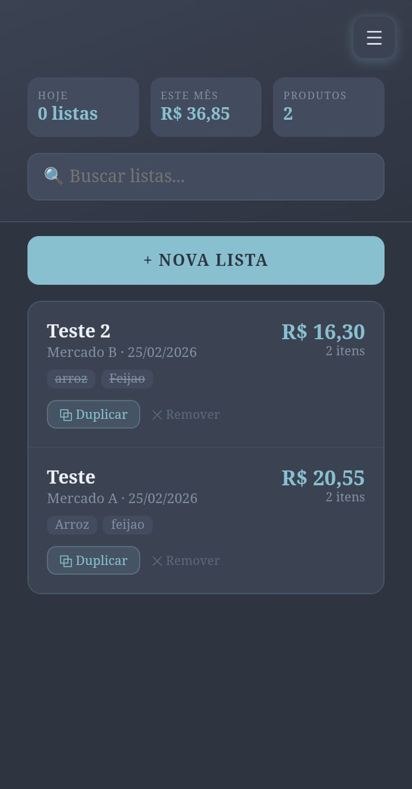 | 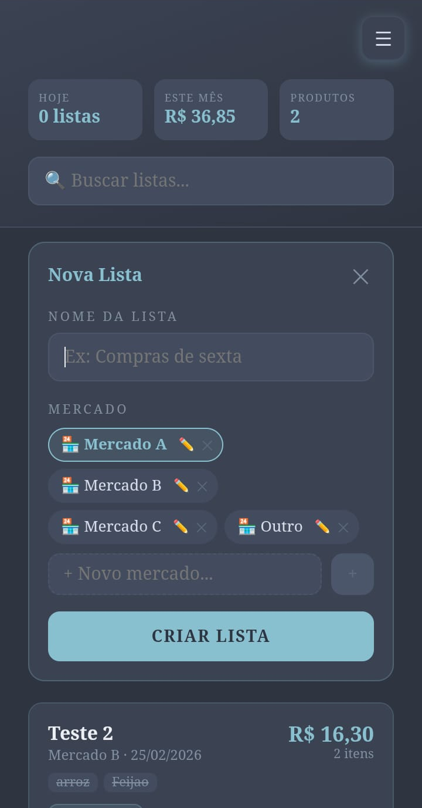 | 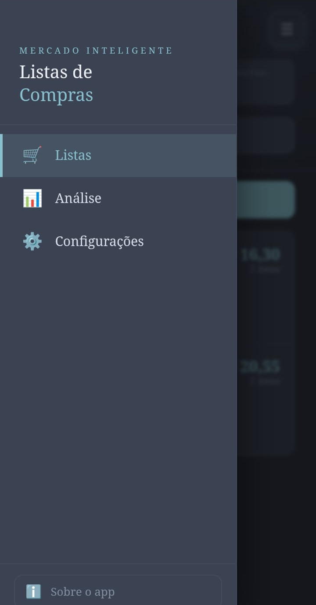 |
| Monthly lists grouped with item summary, total, and product tags | Inline form with store selection and option to add a new store | Navigation between Lists, Analysis, Settings, and About |

---

### 📦 Inside a List

| List items | Sorting menu | Edit item |
|:---:|:---:|:---:|
| 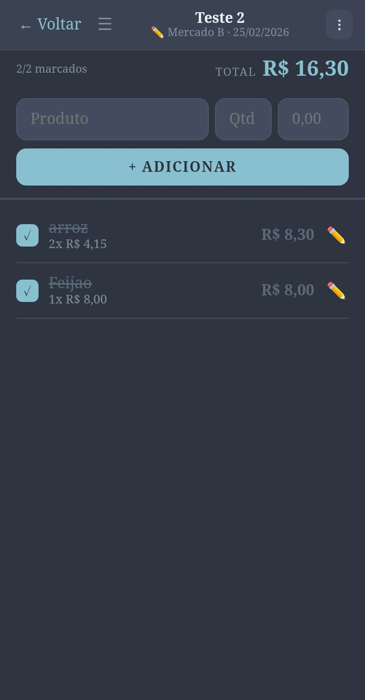 | 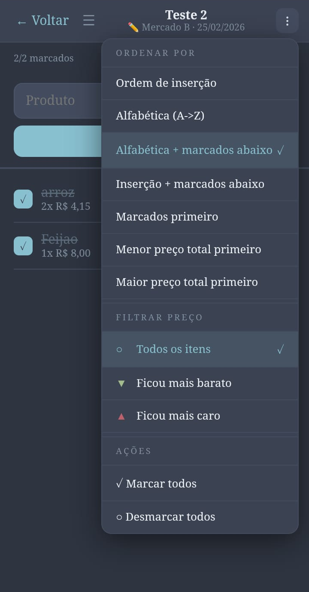 | 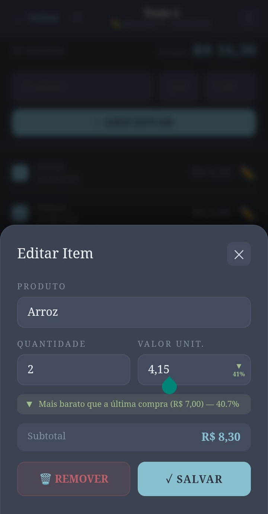 |
| Items with checkbox, quantity, unit price, and total | 6 sort options + price variation filters + bulk actions | Edit with real-time price comparison and subtotal |

---

### 📊 Spending Analysis

| Annual analysis | Monthly analysis | Store comparison |
|:---:|:---:|:---:|
| 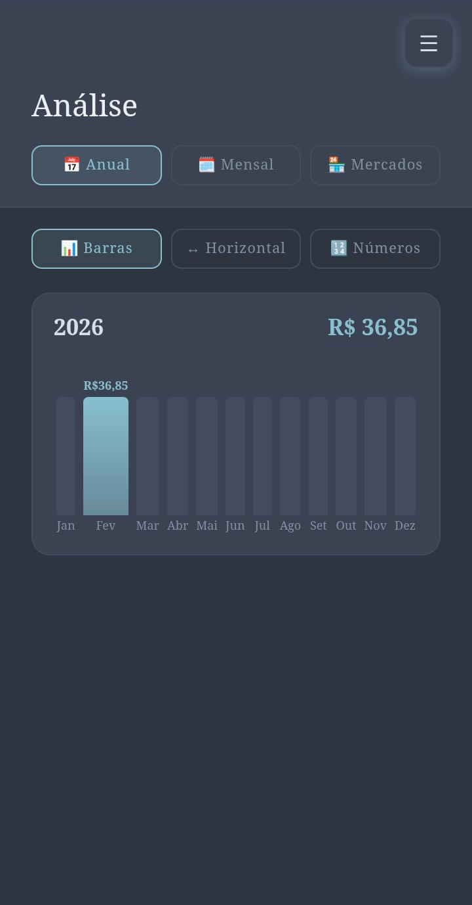 | 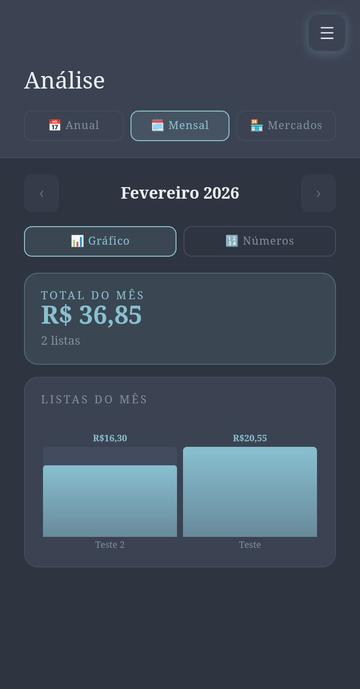 | 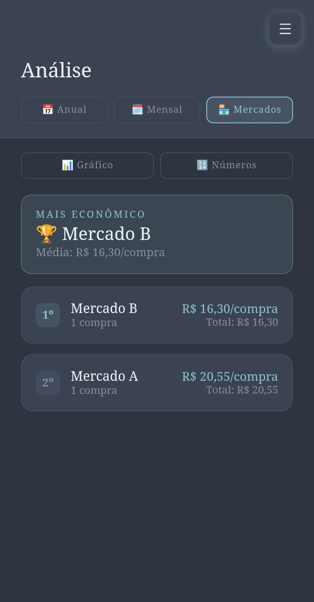 |
| Horizontal bar chart by month with annual total | Bar chart per list with monthly total and month navigation | Store ranking by average price per purchase |

---

### ⚙️ Settings

| Navigation | Appearance | Font size | Data |
|:---:|:---:|:---:|:---:|
| 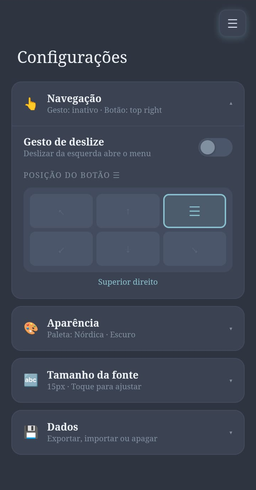 | 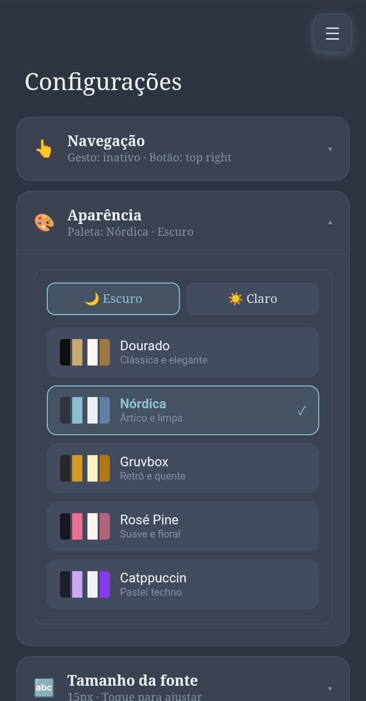 | 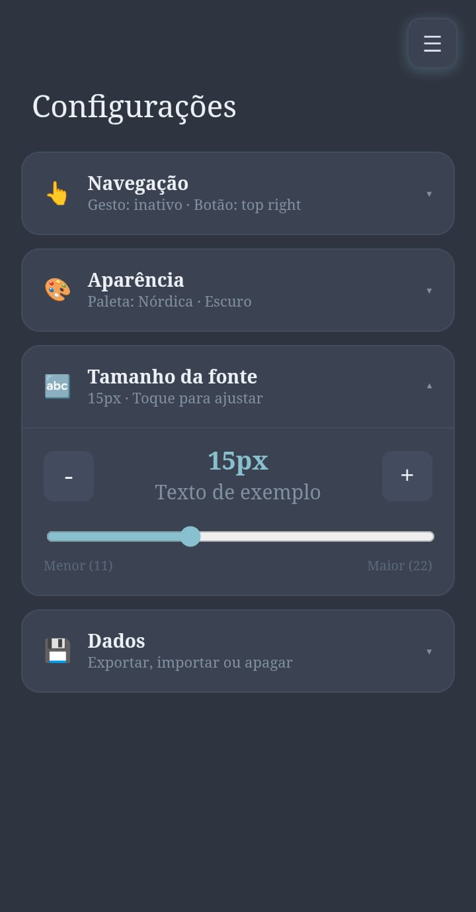 | 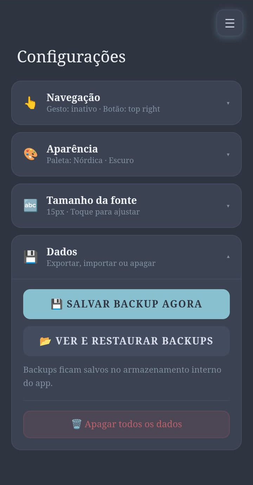 |
| Swipe gesture and ☰ button position | 7 themes with dark/light mode | Size slider with live preview | Backup, restore, and data wipe |

---

### ℹ️ About

<div align="center">
  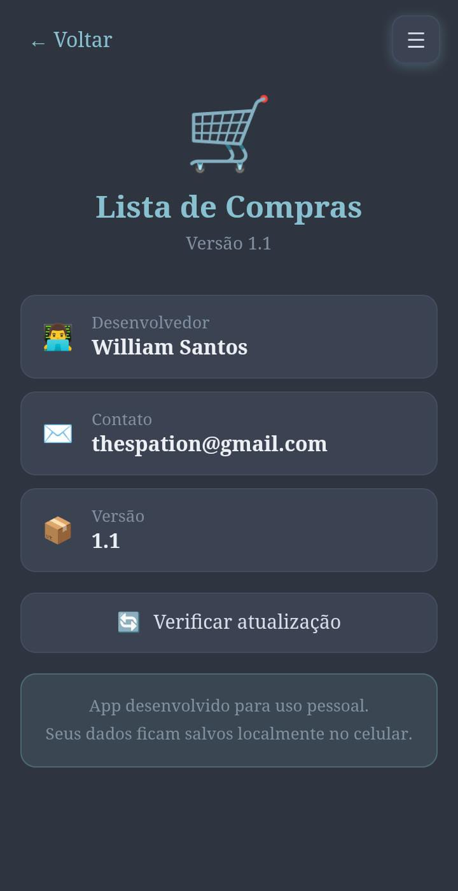
  <br/><sub>Version, developer, and contact info</sub>
</div>

---

## 📱 Download & Installation

1. Go to the [Releases](https://github.com/thespation/lista-compras-android/releases) page
2. Download `app-release.apk`
3. On Android: **Settings → Security → Install unknown apps** → enable for your file manager
4. Open the APK and tap **Install**

> **Minimum requirement:** Android 5.1 (API 22)

---

## ✨ Features

### 🛒 Shopping Lists

- **Create lists** with a custom name, automatic date, and selectable store
- **Organized by month** — current month expanded by default; older months behind a "View history" button
- **Duplicate a list** — copies all items, with options to zero out prices and change the store
- **Global search** — filter lists by name, store, or item
- **Edit name & store** — tap the list header to edit inline
- **Delete list** directly from the main screen

### 📦 List Items

- **Add items** with name, quantity, and price
- **Autocomplete** — suggests names from previous purchases
- **Automatic price comparison** — shows ▼ cheaper or ▲ more expensive vs. last purchase
- **Permanent price arrow** — stays visible even after checking the item
- **Check/uncheck** items as purchased
- **Edit item** — tap ✏️ to fix name, quantity, or price
- **6 sorting options**: insertion order, alphabetical, price, checked first/last
- **Price variation filter** — show only cheaper or pricier items
- **Live list total** updated in real time
- **Check all / Uncheck all** in one tap

### 📊 Spending Analysis

- **Annual spending** — horizontal chart and number table by month
- **Monthly spending** — bar chart per list with monthly total
- **Store comparison** — total and average per store
- **Price history per product** — line chart with full history
- Navigate between months to compare periods

### ⚙️ Settings

#### Navigation
- Enable/disable swipe gesture to open the side menu
- Menu button position (6 positions available)

#### Appearance
- **7 color themes**, each with dark and light mode:
  - 🟡 **Dourado** (Golden) — classic and elegant
  - 🔵 **Nórdica** (Nordic) — clean arctic palette (Nord)
  - 🟤 **Gruvbox** — retro and warm
  - 🌸 **Rosé Pine** — soft and floral
  - 🟣 **Catppuccin** — pastel techno
  - ⚫ **Meia-Noite** (Midnight) — OLED, pure black `#000000`
  - 📄 **Papel** (Paper) — ink on paper, pure white `#ffffff`

#### Font
- Size control (11px to 22px) with slider and +/− buttons

#### Data
- **💾 Save backup now** — snapshot saved to app's internal storage
- **📂 View and restore backups** — list, restore, or delete individual backups
- **🗑 Delete all data** — with confirmation modal

---

## 🗂️ Project Structure

```
lista-compras-android/
├── android/                          # Android Studio project
│   ├── app/
│   │   ├── build.gradle              # Module config (AGP 8.3.2, compileSdk 34)
│   │   └── src/main/
│   │       ├── AndroidManifest.xml   # No internet permission — 100% offline
│   │       ├── assets/public/
│   │       │   ├── index.html        # Full embedded app (~263KB)
│   │       │   └── bundle.js         # Minified React bundle
│   │       ├── java/com/listacompras/app/
│   │       │   └── MainActivity.java # WebView + back button + dark mode bridge
│   │       └── res/
│   │           ├── mipmap-*/         # Icons for all densities
│   │           └── values/themes.xml # Theme.Material.Light.NoActionBar
│   └── gradle/wrapper/
│       └── gradle-wrapper.properties # Gradle 8.5
├── src/
│   └── App.jsx                       # React source (~2200 lines)
├── Imagens/                      # App screenshots
├── README.md                         # Portuguese version
└── README_EN.md                      # This file
```

---

## 🔧 Technologies Used

| Technology | Version | Purpose |
|---|---|---|
| **React** | 18.x | User interface |
| **JavaScript (JSX)** | ES2017+ | Application logic |
| **esbuild** | latest | Bundler — compiles and minifies JSX |
| **Android WebView** | — | Native container for the web app |
| **Java** | 17 | MainActivity, back button, dark mode bridge |
| **Gradle** | 8.5 | Android build system |
| **Android Gradle Plugin** | 8.3.2 | Android build plugin |
| **localStorage** | Web API | Data persistence and backups |

> No external frameworks, no database, no server, no internet.

---

## 🏗️ Architecture

The app is a **Single Page Application (SPA)** built with React and bundled by esbuild into a single ~263KB `index.html`. This file is loaded by a native Android `WebView`.

### Java ↔ JavaScript Bridge

```javascript
window.__androidDarkMode   // boolean — Android system theme
window.__androidBack       // function — back button handler
window.__drawerOpen        // boolean — side menu state
```

### Persistence (localStorage)

| Key | Content |
|---|---|
| `lista-compras-v2` | Lists, items, and price history |
| `lista-compras-settings` | User preferences |
| `lista-compras-backups` | Backup index |
| `lista-compras-backup-{timestamp}` | Individual backup data |

---

## 📲 How to Build the APK

```bash
# 1. Clone the repository
git clone https://github.com/thespation/lista-compras-android.git

# 2. Open Android Studio
# File → Open → select the android/ folder

# 3. If you see "Invalid Gradle JDK": click "Use Embedded JDK"

# 4. Wait for Gradle to sync

# 5. Build → Build Bundle(s) / APK(s) → Build APK(s)
# APK at: android/app/build/outputs/apk/debug/app-debug.apk
```

---

## 🎮 Navigation — Android Back Button

Cascading behavior:
1. Closes any open modal
2. Closes the side menu if open
3. Inside a list → goes back to the lists screen
4. On the About screen → goes back to Lists
5. On Lists/Analysis/Settings → opens the side menu
6. With side menu open → minimizes the app

---

## 👨‍💻 Developer

**William Santos**
- GitHub: [@thespation](https://github.com/thespation)
- Email: thespation@gmail.com

---

## 📄 License

This project is for personal use. Feel free to use it as a reference or base for your own projects.
